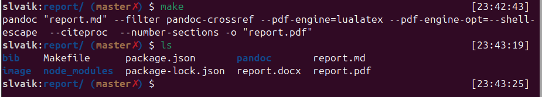
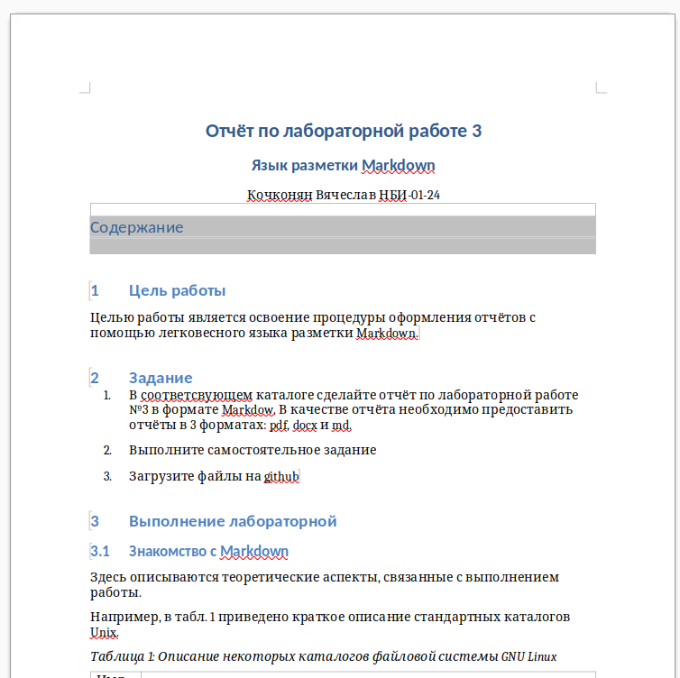
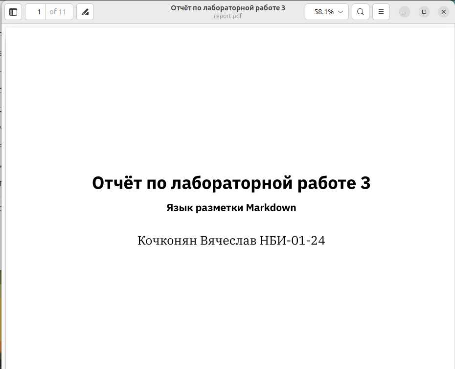
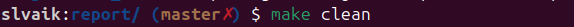
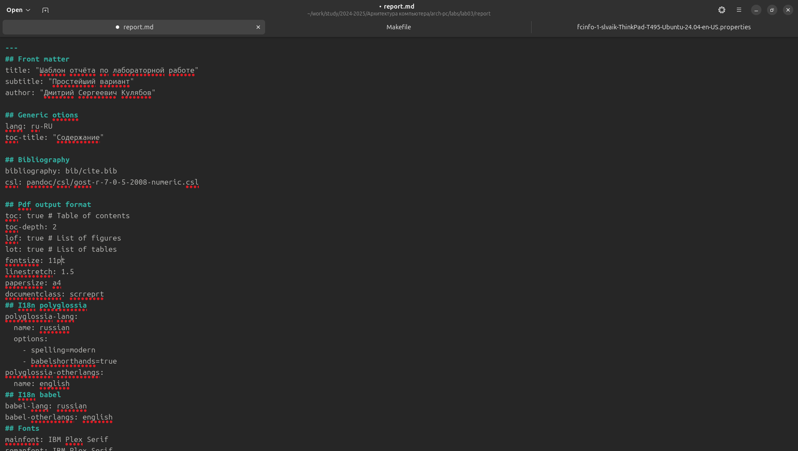
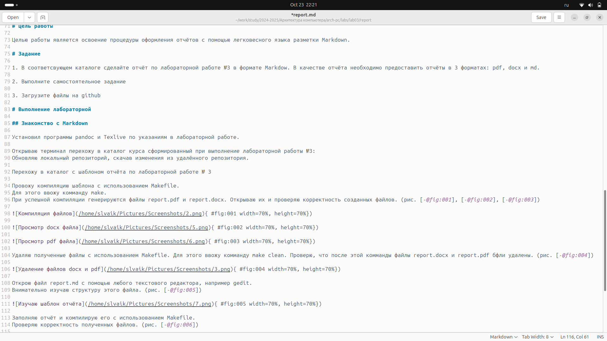

---
## Front matter
title: "Отчёт по лабораторной работе 3"
subtitle: "Язык разметки Markdown"
author: "Кочконян Вячеслав НБИ-01-24"

## Generic otions
lang: ru-RU
toc-title: "Содержание"

## Bibliography
bibliography: bib/cite.bib
csl: pandoc/csl/gost-r-7-0-5-2008-numeric.csl

## Pdf output format
toc: true # Table of contents
toc-depth: 2
lof: true # List of figures
lot: true # List of tables
fontsize: 12pt
linestretch: 1.5
papersize: a4
documentclass: scrreprt
## I18n polyglossia
polyglossia-lang:
  name: russian
  options:
	- spelling=modern
	- babelshorthands=true
polyglossia-otherlangs:
  name: english
## I18n babel
babel-lang: russian
babel-otherlangs: english
## Fonts
mainfont: IBM Plex Serif
romanfont: IBM Plex Serif
sansfont: IBM Plex Sans
monofont: IBM Plex Mono
mathfont: STIX Two Math
mainfontoptions: Ligatures=Common,Ligatures=TeX,Scale=0.94
romanfontoptions: Ligatures=Common,Ligatures=TeX,Scale=0.94
sansfontoptions: Ligatures=Common,Ligatures=TeX,Scale=MatchLowercase,Scale=0.94
monofontoptions: Scale=MatchLowercase,Scale=0.94,FakeStretch=0.9
mathfontoptions:
## Biblatex
biblatex: true
biblio-style: "gost-numeric"
biblatexoptions:
  - parentracker=true
  - backend=biber
  - hyperref=auto
  - language=auto
  - autolang=other*
  - citestyle=gost-numeric
## Pandoc-crossref LaTeX customization
figureTitle: "Рис."
tableTitle: "Таблица"
listingTitle: "Листинг"
lofTitle: "Список иллюстраций"
lotTitle: "Список таблиц"
lolTitle: "Листинги"
## Misc options
indent: true
header-includes:
  - \usepackage{indentfirst}
  - \usepackage{float} # keep figures where there are in the text
  - \floatplacement{figure}{H} # keep figures where there are in the text
---

# Цель работы

Целью работы является освоение процедуры оформления отчётов с помощью легковесного языка разметки Markdown.

# Задание

1. В соответсвующем каталоге сделайте отчёт по лабораторной работе №3 в формате Markdow. В качестве отчёта необходимо предоставить отчёты в 3 форматах: pdf, docx и md.

2. Выполните самостоятельное задание

3. Загрузите файлы на github

# Выполнение лабораторной

## Знакомство с Markdown 

Установил программы pandoc и Texlive по указаниям в лабораторной работе.

Открываю терминал перехожу в каталог курса сформированный при выполнение лабораторной работы №3:
Обновляю локальный репозиторий, скачав изменения из удалённого репозитория.

Перехожу в каталог с шаблоном отчёта по лабораторной работе № 3

Провожу компиляцию шаблона с использованием Makefile.
Для этого ввожу комманду make.
При успешной компиляции генерируются файлы report.pdf и report.docx. Открываю их и проверяю корректность созданных файлов. (рис. [-@fig:001], [-@fig:002], [-@fig:003])

{ #fig:001 width=70%, height=70%})

{ #fig:002 width=70%, height=70%})

{ #fig:003 width=70%, height=70%})

Удаляю полученные файлы с использованием Makefile. Для этого ввожу комманду make clean. Проверю, что после этой комманды файлы report.docx и report.pdf бфли удалены. (рис. [-@fig:004])

{ #fig:004 width=70%, height=70%})

Открою файл report.md с помощью любого текстового редактора, например gedit.
Внимательно изучаю структуру этого файла. (рис. [-@fig:005])

{ #fig:005 width=70%, height=70%})

Заполняю отчёт и компилирую его с использованием Makefile.
Проверяю корректность полученных файлов. (рис. [-@fig:006])

{ #fig:006 width=70%, height=70%})

Загружаю файлы на Github.

# Выполнение лабораторной работы

Подготовил отчёт по лабораторной работе №2 и разместил его в репозитории. (рис. [-@fig:007], [-@fig:008])

# Выводы

При выполнение данной лабораторной работы мы изучили синтаксис языка разметки Markdown, получил отчёт из шаблона при помощи Makefile.

# Список литературы{.unnumbered}

1. Архитектура ЭВМ

2. Markdown Документация
::: {#refs}
:::
